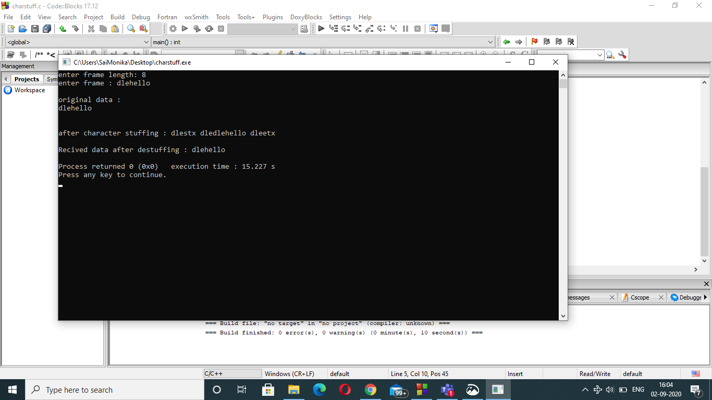

# Experiment 1b

## Aim of the Experiment
To implement data link layer framing technique character stuffing.

### step by step procedure of experiment
1.taking number of frames and input the frames
2.display data at sender
3.display data at reciever
4.display data in the form of frames

### Output

