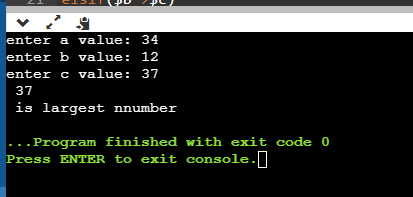

# Experiment 17
## Aim
a) Write a Perl script to find the largest number among three numbers.
          b) Write a Perl script to print the multiplication tables from 1-10 using subroutines.

### Output

